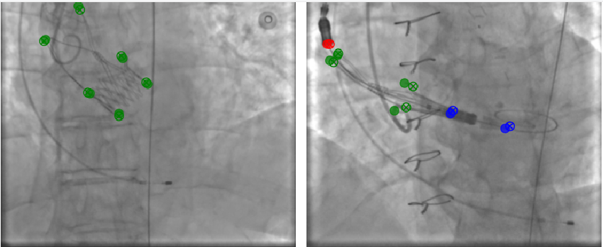

# TAVI Keypoint Detection




Проект для обнаружения ключевых точек на медицинских изображениях с использованием подходов multi-head регрессии. В данном репозитории реализованы два метода:

1. **Multi-head регрессия** – подход, при котором модель напрямую предсказывает флаг наличия точки и её координаты (x, y) с независимыми головами для каждой группы ключевых точек.
2. **HRNet Keypoint Detection** – улучшенная версия, где в качестве бэкбона используется архитектура HRNet, позволяющая извлекать признаки на нескольких разрешениях, что может повысить точность локализации.

## Описание проекта

Данный проект реализует модель для обнаружения ключевых точек на медицинских изображениях TAVI (Transcatheter Aortic Valve Implantation). Модель решает задачу, одновременно определяя:
- Флаг наличия ключевой точки (presence)
- Координаты (x, y) ключевой точки, если она присутствует

Подход с multi-head регрессией позволяет эффективно обрабатывать случаи, когда некоторые точки отсутствуют на изображении, а разделение по группам (group_1, group_2, group_3) учитывает специфические особенности каждого типа точек.

В новой реализации добавлена архитектура HRNet, которая благодаря параллельной обработке признаков на разных масштабах улучшает качество извлечения информации и, как следствие, локализацию ключевых точек.

## Структура проекта

```
TAVI_Keypoint_Detection/
├── dataset.py                      # Класс для работы с датасетом и аугментациями
├── model.py                        # Реализация модели GroupKeypointModel (multi-head регрессия)
├── hrnet_model.py                  # Реализация HRNetKeypointModel и вспомогательных классов для HRNet
├── train.py                        # Скрипт для обучения модели с multi-head регрессией
├── train_hrnet.py                  # Скрипт для обучения модели с использованием HRNet
├── losses.py                       # Комбинированная функция потерь KeypointLoss
├── visualization.py                # Функции для визуализации результатов
├── config.yaml                     # Файл с конфигурационными параметрами
├── requirements.txt                # Список зависимостей
└── README.md                       # Описание проекта и инструкции
```

## Особенности реализации

### Multi-head регрессия

- **Независимые головы для групп**  
  Модель разделяет ключевые точки на три группы:
  - **group_1**: ["CP"] (1 точка)
  - **group_2**: ["FE2_o", "FE1_o", "FE2", "FE1", "EC1", "EC2"] (до 6 точек)
  - **group_3**: ["CT1", "CT2", "CD"] (до 3 точек)
  
  Каждая голова предсказывает наличие (флаг) и координаты (x, y) для точек своей группы, а дополнительная голова осуществляет групповую классификацию (определяет, присутствует ли хотя бы одна точка в группе).

- **Предобученные бэкбоны**  
  Поддерживаются различные архитектуры (ResNet, VGG, DenseNet, EfficientNet, Vision Transformer). Для каждого типа модели реализована специфическая обработка признаков (например, глобальный пулинг для VGG или изменение размера для ViT).

- **Комбинированная функция потерь**  
  Функция потерь (KeypointLoss) включает:
  - **Focal Loss** для точного предсказания наличия ключевой точки.
  - **Wing Loss** для регрессии координат.
  - **BCE Loss** для групповой классификации.

- **Аугментация данных**  
  Применяются стандартные техники: случайное масштабирование, повороты, горизонтальные отражения, изменение яркости/контраста, размытие и добавление шума.

### HRNet Keypoint Detection

- **Архитектура HRNet**  
  В новой реализации используется HRNetKeypointModel, которая:
  - Начинается с базовых сверточных блоков для понижения разрешения.
  - Состоит из нескольких этапов (stage) с переходами между ветвями, что позволяет обрабатывать признаки на нескольких масштабах одновременно.
  - После объединения всех разрешений применяется финальный сверточный слой, глобальный пулинг и полностью связанные слои для предсказания общих признаков.
  - Далее с использованием независимых голов предсказываются групповые вероятности и координаты ключевых точек для каждой группы.

- **Обучающий скрипт `train_hrnet.py`**  
  Скрипт обучения для HRNet версии включает:
  - Инициализацию датасетов с аугментациями.
  - Загрузку модели HRNetKeypointModel с настройкой ширины (параметр `hrnet_width`).
  - Определение оптимизатора, планировщика скорости обучения и функции потерь.
  - Логирование метрик и визуализаций с использованием TensorBoard.

## Установка и запуск

### Установка зависимостей

Создайте виртуальное окружение и установите необходимые библиотеки:

```bash
pip install -r requirements.txt
```

### Настройка конфигурации

Отредактируйте файл `config.yaml` и укажите:
- Путь к датасету (`dataset_path`)
- Параметры обучения: batch size, learning rate, количество эпох, число рабочих процессов и т.д.
- Название бэкбона (`backbone_name`) для multi-head модели (например, `resnet18`, `vgg16` и т.п.)
- Для HRNet задайте параметр `hrnet_width` (если он не указан, по умолчанию используется значение 18)
- Параметры визуализации и директории для сохранения моделей

### Запуск обучения

- **Для обучения модели с multi-head регрессией:**

  ```bash
  python train.py
  ```

- **Для обучения модели с использованием HRNet:**

  ```bash
  python train_hrnet.py
  ```

В процессе обучения выводятся метрики (общая потеря, потери по наличию, координатам и группам). Лучшие модели сохраняются в директории, указанной в `checkpoint_dir`, а визуализации первого батча каждой эпохи логируются в TensorBoard.

### Мониторинг TensorBoard

Запустите TensorBoard для просмотра логов:

```bash
tensorboard --logdir=runs
```

Откройте предоставленный URL в браузере.

## Преимущества подхода

1. **Простота и эффективность**  
   Отсутствие необходимости генерации тепловых карт упрощает архитектуру и снижает вычислительную нагрузку.

2. **Учет групповой структуры ключевых точек**  
   Независимые головы для каждой группы позволяют лучше адаптироваться к специфике различных классов точек.

3. **Гибкость**  
   Возможность использования различных предобученных бэкбонов (ResNet, VGG, DenseNet, EfficientNet, ViT) и добавление новой архитектуры HRNet для улучшенного извлечения многоуровневых признаков.

4. **Обработка отсутствующих точек**  
   Использование флага наличия позволяет корректно обрабатывать случаи, когда некоторые ключевые точки отсутствуют на изображении.


## Возможные улучшения

- **Эксперименты с различными бэкбонами**  
  Протестируйте разные архитектуры для оптимизации качества предсказаний.
- **Тонкая настройка функции потерь**  
  Исследуйте влияние параметров Focal Loss и Wing Loss.
- **Расширенная аугментация**  
  Добавьте дополнительные методы аугментации для повышения устойчивости модели.

## Результаты тестирования моделей

Ниже представлены результаты тестирования различных моделей на валидационном наборе данных TAVI_512_split. Тестирование проводилось на 259 изображениях размером 512x512 пикселей.

| Метрика | ResNet18 | ResNet34 | ResNet50 |
|---------|---------|---------|----------|
| Precision | 0.8821 | **0.9235** | 0.8740 |
| Recall | 0.9036 | **0.9602** | 0.8804 |
| F1 Score | 0.8803 | **0.9332** | 0.8649 |
| Средняя ошибка (пиксели) | **25.61** | 25.65 | 37.69 |
| Точность локализации | **0.5570** | 0.5505 | 0.2541 |


## Заключение

Проект TAVI Keypoint Detection демонстрирует современный и эффективный подход к обнаружению ключевых точек на медицинских изображениях. Благодаря использованию multi-head регрессии и различных архитектур бэкбонов, модель способна точно определять наличие и координаты ключевых точек даже при их частичном отсутствии. Этот проект может служить хорошей отправной точкой для дальнейших исследований и практических приложений в области медицинской визуализации.