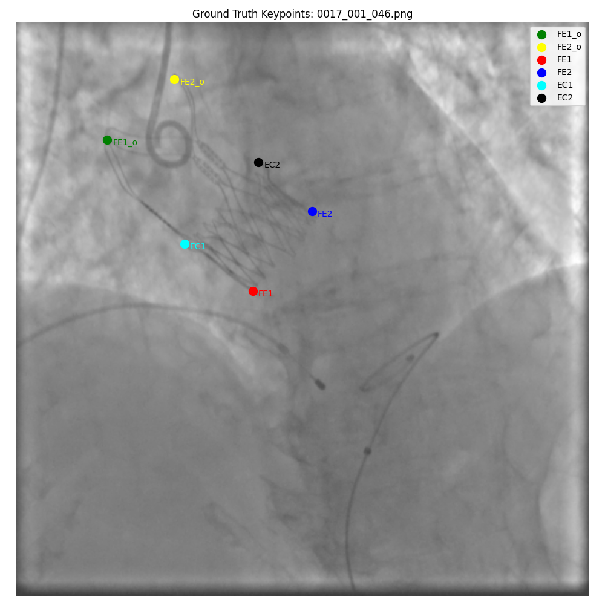

# TAVI Keypoint Detection



Проект для автоматического обнаружения и локализации ключевых точек на медицинских изображениях TAVI (Transcatheter Aortic Valve Implantation) с использованием современных методов глубокого обучения.

## Описание проекта

Данный проект реализует систему для автоматического обнаружения и локализации ключевых точек на медицинских изображениях TAVI (Transcatheter Aortic Valve Implantation). 

В проекте реализованы два основных подхода к обнаружению ключевых точек:

1. **Подход на основе многовыходной регрессии (Multi-head Regression)** - модель одновременно предсказывает:
   - Наличие ключевой точки (бинарная классификация)
   - Координаты (x, y) ключевой точки (регрессия)

2. **Подход на основе тепловых карт (Heatmap-based)** - модель генерирует тепловые карты для каждой ключевой точки, где максимум соответствует позиции точки.

Оба подхода имеют свои преимущества и особенности, которые подробно описаны в разделе "Архитектуры и подходы".

## Структура проекта

```
TAVI_Keypoint_Detection/
├── dataset.py                      # Класс для работы с датасетом
├── model.py                        # Реализация модели с многовыходной архитектурой
├── train.py                        # Скрипт для обучения модели
├── config.yaml                     # Файл с конфигурационными параметрами
├── requirements.txt                # Список зависимостей
└── README.md                       # Описание проекта и инструкции
```

## Особенности реализации

- **Архитектура модели**: Используется предобученная ResNet18 в качестве бэкбона с дополнительными полносвязными слоями для предсказания наличия и координат ключевых точек.
- **Функция потерь**: Комбинация BCE (Binary Cross Entropy) для предсказания наличия точки и L1 Loss для регрессии координат.
- **Аугментации**: Реализованы случайные повороты, масштабирование и отражения для улучшения обобщающей способности модели.

## Классы ключевых точек

Модель работает со следующими группами ключевых точек:
- **group_1**: ["CP"] (1 точка)
- **group_2**: ["FE2_o", "FE1_o", "FE2", "FE1", "EC1", "EC2"] (до 6 точек)
- **group_3**: ["CT1", "CT2", "CD"] (до 3 точек)

## Установка и запуск

### Установка зависимостей

```bash
pip install -r requirements.txt
```

### Настройка конфигурации

Перед запуском убедитесь, что в файле `config.yaml` указан правильный путь к датасету и настроены остальные параметры.

### Запуск обучения

```bash
python train.py
```

## Преимущества подхода multi-head регрессии

1. **Простота реализации**: Не требуется генерация и обработка карт тепла (heatmaps).
2. **Эффективность**: Хорошо работает для задач с ограниченным числом ключевых точек.
3. **Гибкость**: Легко обрабатывает случаи, когда некоторые точки отсутствуют на изображении.
4. **Масштабируемость**: Можно легко добавлять новые классы ключевых точек.
